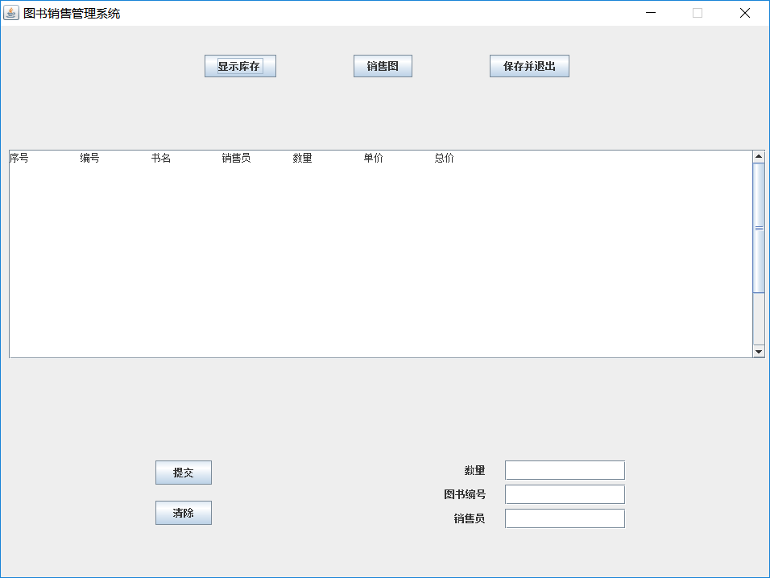
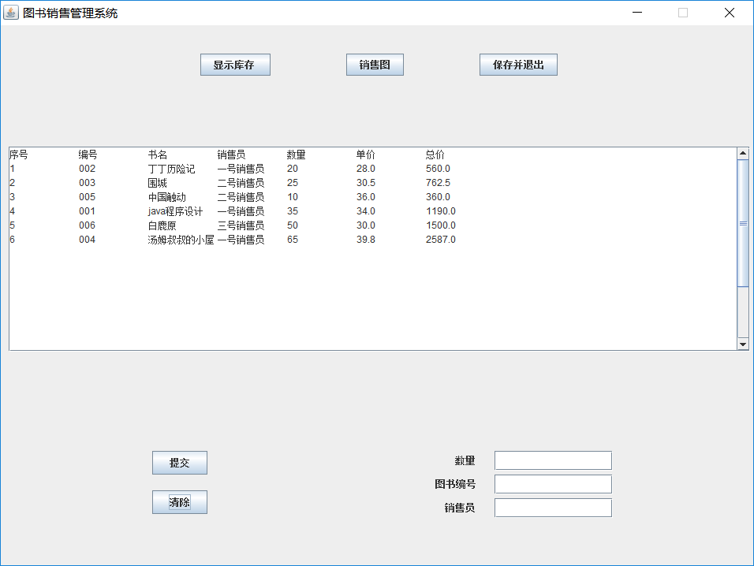
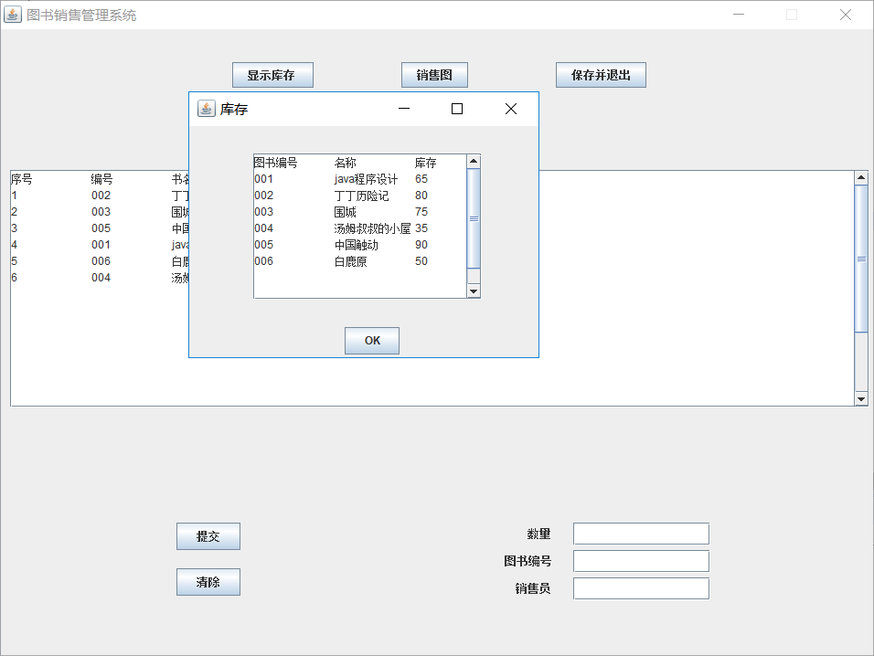
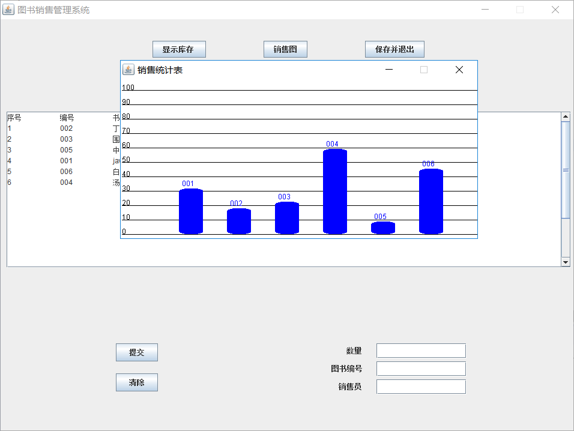
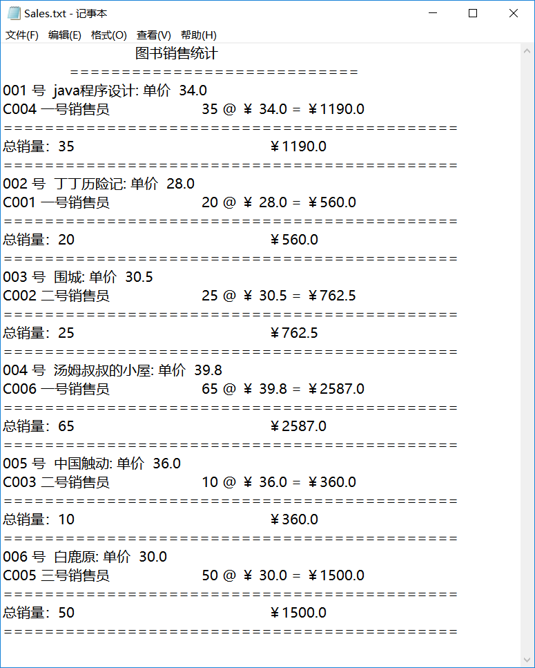

# Books-Sales-Management-Software
An open source book sales management software written by Java.
## About
A store sells books. The original information of books (book code, book name, unit price) is placed in the file "Books. txt", and the program is written to count book sales. The initial stock of each book is 100.
## Function
- Display sales information through a textArea in the main window.
 

- Enter and process each sales situation in the main window.
 

- Open a frame that displays the information of book stock through a button.
 

- Open a frame that displays the sales statistics by through a button.
 

- Write sales information to text file and exit the system.
 

## test
- A
- B
- C

